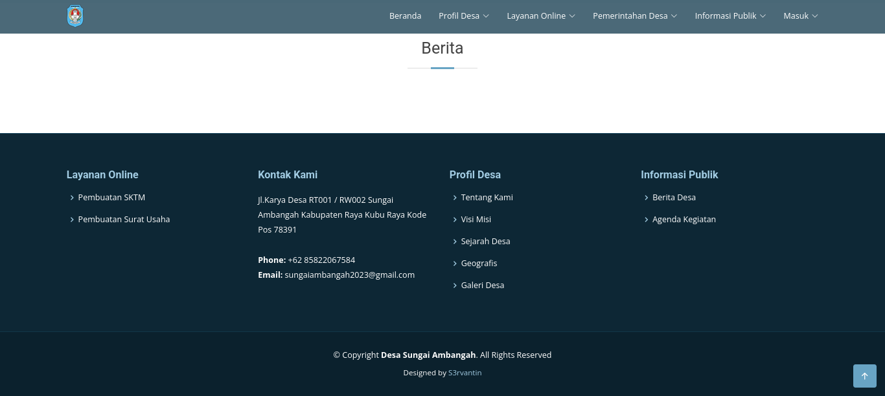
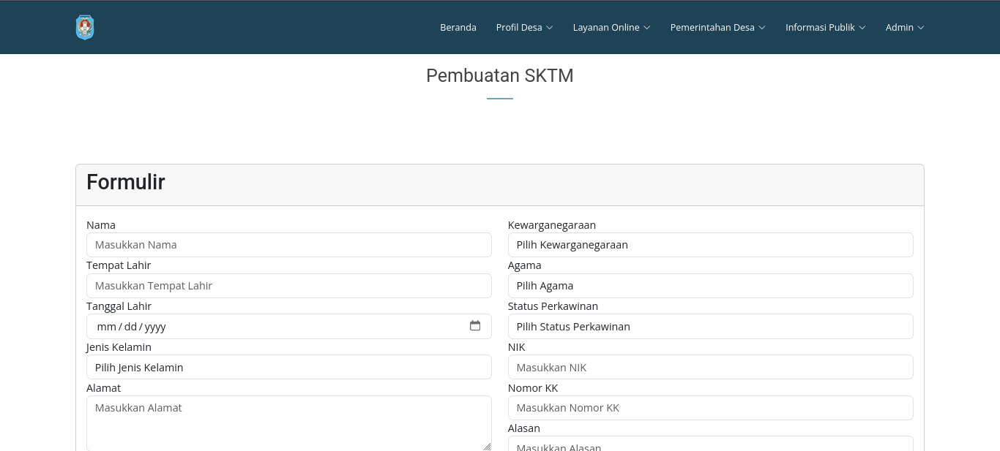
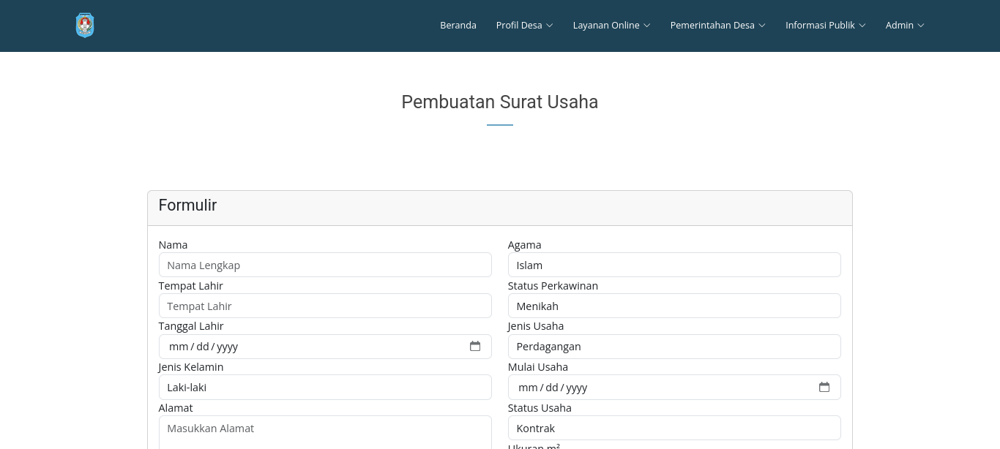
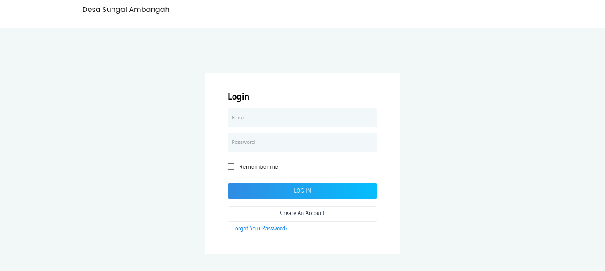
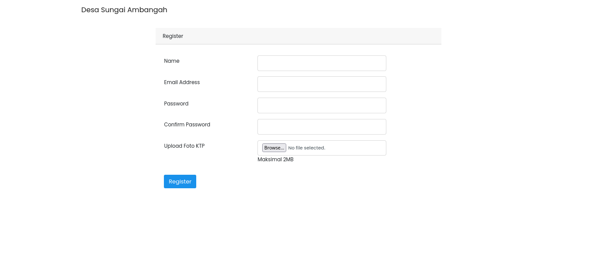

  <h1>🌟 SIPEBI</h1>
  
<strong>Project Desa Sungai Ambangah</strong>

---

## 📖 Tentang Proyek

SIPEBI adalah sebuah sistem informasi berbasis web yang dikembangkan untuk **Desa Sungai Ambangah**. Aplikasi ini dibangun untuk memberikan kemudahan akses informasi dan manajemen data secara digital.

## 🚀 Teknologi yang Digunakan

- **Framework:** Laravel 10
- **Bahasa Pemrograman:** PHP 8.1+
- **Database:** MySQL
- **Library Tambahan:** DomPDF, Intervention Image, dll.

## 📸 Dokumentasi / Screenshot

### 🏠 Halaman Beranda (Home)

### 💻 Halaman Dasbor (Dashboard)

### Login

### Register

---

## 👥 Tim Pengembang

Proyek ini dikembangkan oleh:

| Nama Lengkap                   | NIM        |
| :----------------------------- | :--------- |
| **Maulana Aditya Pratama**     | `12210778` |
| **Listia Priwida**             | `12210744` |
| **Desyka Shalu Putri Velijha** | `12210753` |

---

  
Dibuat dengan ❤️ untuk Desa Sungai Ambangah

